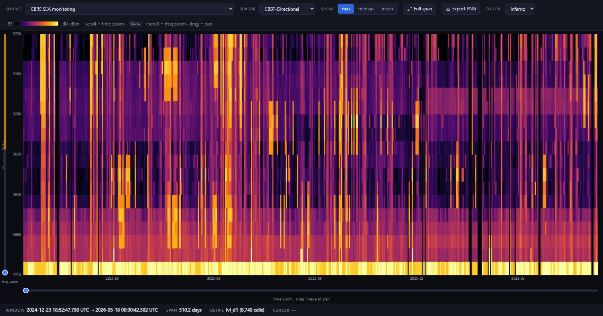
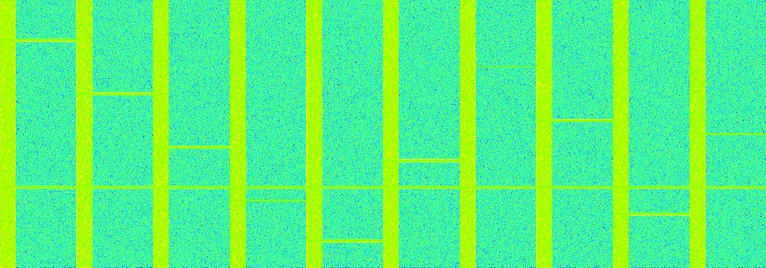
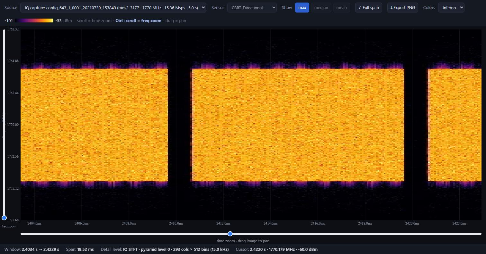

# ATLAS - Automatic Tiled Layering for Analyzing Spectra

"Google Maps for RF spectrum": one interface where **X is always time**
and color is power. Continuously zoom from a two-year overview down to the microsecond
structure, instantly. The viewer swaps resolution layers automatically as
you go.



It draws two independent data sources on the same machinery:

- **CBRS SEA monitoring**: the [NIST NASCTN CBRS SEA](https://www.nist.gov/programs-projects/spectrum-monitoring-cbrs-band)
  dataset (10 sensors, 3.5 GHz band, ~2 years), as one continuous time axis.
- **IQ captures**: STFT spectrograms of individual [NIST I/Q recordings](https://www.nist.gov/ctl/spectrum-technology-and-research-division/applied-systems-metrology-group/iq-data-sets)
  (SigMF / TDMS), each with its own time and frequency axes.

The real datasets are multi-GB and are **not** in this repo. A built-in synthetic
demo lets you run everything with no downloads.

# Quick start

**You need:** Python 3.10 or newer, `git`, and a web browser. Check Python with
`python --version` (if that says "not found", try `python3 --version`, or `py
--version` on Windows).

Below, use whichever of `python` / `python3` / `py` works on your machine.

**1. Get the code**

```bash
git clone https://github.com/jimmylu7/ATLAS.git
cd ATLAS
```

**2. Create a virtual environment, then install**

A virtual environment is required on most Linux and macOS systems (a bare `pip
install` there fails with "externally-managed-environment").

```bash
python -m venv .venv                  # creates a local .venv folder

# activate it:
source .venv/bin/activate             # macOS / Linux
.venv\Scripts\activate                # Windows PowerShell

pip install -r requirements.txt
```

**3. Build the demo data and check the install**

```bash
python atlas.py
```

With nothing built yet it offers to build a small synthetic capture
(`iq.duckdb`, ~2 MB, next to `serve.py`) and start the viewer. Pick that, and
the check it runs must end with:

```
RESULT: PASS
```

If it says `FAIL`, the line above it names the problem. See
[Troubleshooting](#troubleshooting).

**4. Start the viewer**

```bash
python atlas.py serve
```

Open **http://127.0.0.1:8090** in your browser. In the header, open the
**Source** dropdown and pick **"IQ capture: demo_signal"**.



You should see a horizontal line (a carrier), stepping horizontal
segments (a hopping tone), and evenly spaced vertical bands (periodic bursts).
Scroll to zoom in time, `Ctrl`+scroll to zoom in frequency, drag to pan. To
stop the server, press `Ctrl+C` in the terminal.

That is the whole install. Everything below is optional.

# Troubleshooting

| Symptom | Fix |
|---|---|
| `python: command not found` | Use `python3` (macOS/Linux) or `py` (Windows). |
| `error: externally-managed-environment` | You skipped the virtual environment in step 2. |
| `ModuleNotFoundError: No module named 'duckdb'` | The venv isn't active, or step 2's `pip install` didn't run. Re-activate and re-run it. |
| `Address already in use` / page won't load | Port 8090 is taken. Run on another port: `SEA_PORT=8095 python serve.py` (PowerShell: `$env:SEA_PORT=8095; python serve.py`), then open that port. |
| Browser shows "No spectrum data found" | Run `python atlas.py doctor`. It reports what is built and what to do next. |
| Anything else | Run `python atlas.py doctor`. |
| Server prints "spectrum.duckdb not found" | Expected. That's the optional multi-GB CBRS data; IQ mode still works. |

# For AI agents (Claude Code, Cowork, etc.)

Paste this to have an agent entirely install the project:

```text
Clone https://github.com/jimmylu7/ATLAS.git and install it.
Create a virtual environment, install requirements.txt into it, then run
`python atlas.py setup` and show me the output. (Use `setup`, not a bare
`python atlas.py`, which is interactive and will wait for a choice.) Do not modify any
repository files. The install is correct only if that command prints
"RESULT: PASS"; if it prints FAIL, report the failing check verbatim and stop.
Finally, start `python atlas.py serve` and confirm http://127.0.0.1:8090
responds.
```

`atlas.py setup` runs `examples/verify.py`, which is the main tell for "did
this work": it checks the Python version, the imports, the demo database and
every API endpoint in-process (no browser or free port required), and exits 0
on success. `python atlas.py status` answers "what is built" at any point.

# What the two modes show

## CBRS monitoring mode

One continuous interface where X is always time. As you zoom in, the viewer swaps
between three stored-resolution layers automatically:

| Layer | Source | Resolution | Shown when |
|-------|--------|------------|------------|
| **Summary** | `spectrum.duckdb` | ~90 s sweeps, 18 channels | zoomed out (months → days) |
| **PSD** | `psd.duckdb` | 2250 freq bins @ 80 kHz, ~4-min captures | time span ≤ 3 days |
| **PFP** | `pfp.duckdb` | 560 pts across a 10 ms frame (~18 µs/pt) | freq narrowed to ~1 channel, or span ≤ 30 min |

Frequency zoom is the vertical slider on the left (drag up = zoom in); drag the
screen vertically to pan frequency.

## IQ capture mode

The **Source** dropdown switches to an independent library of I/Q captures. Each
renders as a multi-resolution STFT spectrogram pyramid (`iq.duckdb`) on its own
axes: elapsed time within the capture on X, `fc ± fs/2` on Y, with the same
continuous zoom and locked colours. Below is a NIST high-SNR FDD-LTE uplink
capture showing the burst / resource-block structure.



# Bring your own dataset

```bash
python atlas.py
```

That is the whole thing. With no arguments it checks the machine, works out
which situation you are in, and offers the fix as a numbered choice:

```
ATLAS
checking this machine ...

  ready    nothing built yet
  found    730 psd, 730 pfp, 12 summaries in C:\Users\you\Downloads  (2.1 GB)
  disk     104.7 GB free

What would you like to do?
  1) Load the data in C:\Users\you\Downloads (2.1 GB)      <- recommended
  2) Build the demo and start the viewer
  3) Download a dataset from NIST (lte-uplink, cbrs-sea)
  4) Search this whole machine for data
  5) Check everything (environment, disk, databases)
```

It searches the usual download folders for you, identifies databases by the
tables inside rather than the filename (so a `spectrum_viewer.db` is recognised
for what it holds), and warns when free space is short. With no terminal
attached it prints the recommendation instead of guessing.

If you already know what you want, every choice above is also a direct command:

| Command | What it does |
|---|---|
| `python atlas.py` | the menu above |
| `python atlas.py doctor` | full report: environment, dependencies, disk, databases, data |
| `python atlas.py scan` | find spectrum data on this machine, change nothing |
| `python atlas.py get <thing>` | a folder, a file, a dataset name, a record id, a DOI, or any URL |
| `python atlas.py status` | what is built |
| `python atlas.py serve` | start the viewer |

`get` accepts anything: a local folder or file, a friendly name from
`datasets.json`, a NIST PDR record id or `ark:`, a DOI or landing URL, or a
direct file URL to any https host. It downloads only when the target is not
already local, classifies every file it finds, and runs the ingest each one
needs. Add `--dry-run` to see the plan, `--ask` to confirm it first, or
`--compact` to shrink the databases afterwards.

<details>
<summary>Driving the ingest scripts directly</summary>

`atlas.py` runs these for you; they also work standalone.

| Script | Builds | Notes |
|--------|--------|-------|
| `ingest/fetch.py` | (downloads) | a record from NIST or anywhere else. `--list` summarises by folder, `--tree` shows structure, `--filter` narrows |
| `ingest/build_db.py` | `spectrum.duckdb` | summaries + pyramid levels |
| `ingest/psd_ingest.py` | `psd.duckdb` | PSD `max`. `--list` shows what is on disk |
| `ingest/pfp_ingest.py` | `pfp.duckdb` | PFP `max_peak` |
| `ingest/iq_ingest.py` | `iq.duckdb` | STFT pyramid (SigMF/TDMS/npy) |
| `ingest/compact_db.py` | smaller files | optional; the server reads either schema |

Each ingest finds its own source files by name, searched recursively, so the
download layout does not have to match anything. `--root` defaults to
`$SEA_DATA_ROOT`, else `./SEA-DATA`. A NIST record id, `ark:`, DOI, landing
URL or direct file URL all work as a `fetch.py` source; non-NIST hosts are
allowed with a warning (`--nist-only` to refuse, `--allow-host` to permit one).

```bash
python ingest/fetch.py mds2-3177 --list
python ingest/fetch.py mds2-3177 --filter 1.4MHz/config_0 --dest iqdata/mds2-3177
python ingest/iq_ingest.py iqdata/mds2-3177 --dataset mds2-3177
```

Per-dataset format notes for the four NIST I/Q sets are in
[docs/IQ_DATASETS.md](docs/IQ_DATASETS.md).

</details>

# Architecture

- **`serve.py`**: the whole backend (Flask). Serves `viewer.html` and the APIs
  (`/api/heatmap`, `/api/psd_layer`, `/api/pfp_frame`, `/api/iq_*`, plus `*_meta`
  availability endpoints). For each request it picks the coarsest stored level
  that still has detail for the window and renders WebP tiles (numpy + Pillow;
  axis metadata rides in the `X-Meta` response header). Reads the DuckDB files
  read-only, with a per-request connection so renders are thread-safe. The CBRS
  databases are optional: without them the server still serves IQ captures, and
  it reads each one in whichever of the two schemas is on disk.
- **`viewer.html`**: single-file canvas app, no build step. Zoom/pan, the layer
  swaps, the zoom sliders and colour locking all live here.
- **`ingest/`**: the data-build tooling. `sigmf_io.py` is a unified reader for
  IQ capture formats (SigMF / TDMS / npy).

**Data storage.** Quantized **int8** spectra/frames, grouped into
**zlib-compressed chunks** of consecutive captures. Summary tables store dBm as
`SMALLINT` (dBm×10). The IQ pyramid stores int8 STFT columns with a fixed
per-capture `vmin/vmax` so colours never drift on zoom.

```
atlas.py            one command: setup / get / status / serve
serve.py            Flask backend (app entry point)
viewer.html         single-file canvas frontend
datasets.json       friendly names -> PDR records
requirements.txt    dependencies, with tested versions
examples/           demo data, the install check, and the offline tests
docs/               screenshots + IQ dataset notes
ingest/             fetch + database-build tooling, all resumable
```

This repo contains **only code**, no spectrum data. The measurements are public
NIST datasets; the ingest scripts expect their file products laid out locally.

# Contact

Jimmy Lu
GitHub: [@jimmylu7](https://github.com/jimmylu7)
Email: [jflu@unc.edu](mailto:jflu@unc.edu) or [jimmy.lu@nist.gov](mailto:jimmy.lu@nist.gov)

# NIST data acknowledgment & disclaimer

This project visualizes public datasets from the National Institute of Standards
and Technology (NIST): the NASCTN CBRS SEA monitoring data and the Applied Systems
Metrology Group I/Q data sets. It is an independent visualization tool and is not
endorsed by NIST.

Certain commercial equipment, instruments, software, or materials may be
identified in this repository to foster understanding. Such identification does
not imply recommendation or endorsement by the National Institute of Standards
and Technology, nor does it imply that the materials or equipment identified are
necessarily the best available for the purpose.
